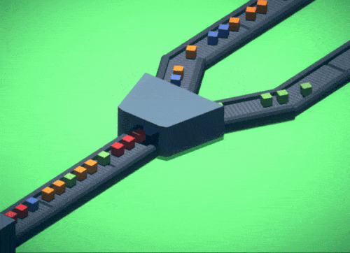
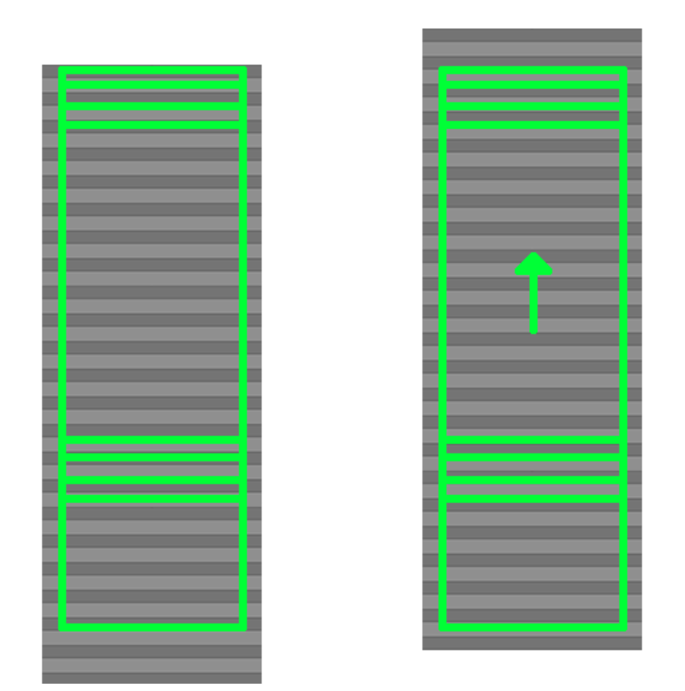
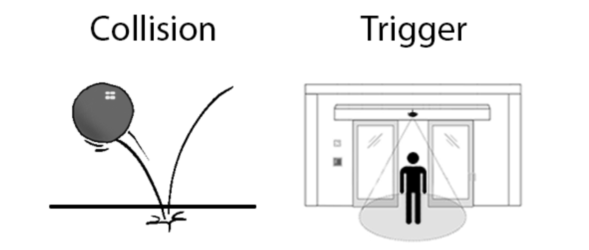

**The University of Melbourne**
# COMP30019 – Graphics and Interaction

## Workshop 10


# Introduction:

For this practice you will be making a simple conveyor system to sort items by what the item represents. This system will have an item generator machine, conveyor belts and sorting machine. The scene will be in 3D but be represented in an orthographic perspective.

# Task:

**1.** Open `\Assets\Scenes\MachineSystemScene.unity` in Unity and press the `Play` button. You can see that... nothing is happening, that’s because you’ll be adding the functionality!

<p align="center">
  
</p>

**Creating the item**  

You’ll start with creating the item.

  
**2.** Create a Cube and change its size to 0.2 units, and add a RigidBody component This will give the cube physics, so it can fall and be pushed around.

<br/>**a.** Let’s make it bouncy now. In the project window go to the Other folder and right click,
create a Physics Material. Select it and in the inspector give it a bouncy value of 0.5 

<br/>**b.** Select the cube in the scene and drag the newly create physics material into the Box
Collider component. If you hit play and drag the cube up high, you can see how it will
bounce around.

**3.** Create a script in the scripts folder called `ConveyorItem` and attach it to the Cube in the scene

<br/>**a.** Open the `ConveyorItem.cs`.

<br/>**b.** The sorting machine will need to know what type of item it is, you can solve this with
enumeration! You can create an enum type by writing this at the bottom of the class

```c# 
public enum ItemType
{
	Apple, 
	Pear, 
	Orange, 
	Blueberry
}
```

<br/>**c.** Create a public variable for this enum in the class, this will allow us to assign it in the scene itself through the inspector window
 
<br/>**d.** In the Start() method write functionality that will take the ItemType and change the cubes colour depending on the type you assign it. You can do this by getting the renderer component, get the instance material, and set the colour to
	i. Red for Apple 
	ii. Green for Pear
	iii. Orange for Orange
	iv. Blue for Blueberry

<br/>**e.** You can test to see if this works by changing the ItemType in the inspector and pressing
play to see if the colour changes. If all is good, then you can turn this item into a prefab. To do that simply drag the cube from the scene hierarchy into the project window. Drag it into the Prefabs folder.

**Moving the conveyor belts**  

Now to provide the conveyor belts the functionality of moving items across. For this you need make the animation of belt appear to move and move the items themselves.


**4.** Create a class called `BeltMovement.cs` and attach it to belt gameobject under one of the conveyor belts in the scene. In the inspector at the top, click apply to apply this new component to all the other conveyor belts. This is how prefabs can be used, to sync duplicate gameobjects.

<br/>**a.** Open the `BeltMovement.cs` and create a variable _beltMaterial of type Material. Assign this variable in the `Start()` method to the first material that the RendererComponent has. You will be accessing this component in the update loop, so it’s best practice to store this component as a variable. This is assuming of course that the component will not be null as the game progresses.

<br/>**b.** The way that you are going to make the belt appear to be moving is by translating the texture that the mesh has vertically by changing it’s offset. The image shown below shows the UV mapping of the belt mesh. By moving the texture vertically, the belt should give the illusion of the belt moving the tracks. Have a look at the texture the object is using, you may be wondering why it looks unlike the texture below. This is because the image take advantage of tiling the texture onto the mesh. Think of some advantages that this may provide.

<p align="center">
  
</p>

<br/>**c.** Next thing you’ll be doing is moving any item that is on belt. When it comes to collisions there are three different types of method you can override: OnCollisionEnter, OnCollisionStay, OnCollisionExit they are used for what you can imagine a gameobject that starts to touch the collider, staying in the collider and stop touching the collider.
 
<br/>**d.** For moving items use OnCollisionStay, add this override to the class:
```C#
    void OnCollisionStay(Collision collisionInfo)
```

You can access the rigidbody component of the item that the belt is colliding with by
accessing the rigidbody component in collisionInfo. Use the `MovePosition()` method to move the item in the direction of the belt. The direction of the belt can be determined by accessing the transform.forward Vector3 attribute and using that in relation to the item’s next position.

<br/>**e.** You can test the functionality on the conveyor belts by dropping the item onto the conveyor belts. Hopefully it should move along the belts!

**Sorting Machine**  

Alrighty Now you’re going to make the sorting machine teleport items from one conveyor belt to another depending on what type the item going is.

**5.** First start by creating a script called `SortingMachineController` and attach to the SortingMachine.

<br/>**a.** Open the class and begin by creating two public variables called LeftExit and RightExit with the type of transform.

<br/>**b.** Save the file and go back to the editor. Assign the two variables that you just created in the inspector to the LeftExit and RightExit child gameobjects within the SortingMachine gameobject.

<br/>**c.** In the Box Collider component tick the IsTrigger Boolean to mark the type of collider the machine has.

<br/>**d.** With unity there are two different ways objects can collide with each other: Collisions and Triggers. An example of a collision would be a ball falling onto the ground, upon impact there is a collision. An example of a trigger would be walking to an automatic sliding door. When you get close enough the doors open, the area that you walk through is the trigger that instructs the door to open.

<p align="center">
  
</p>

There are three overrides you can use are `OnTriggerEnter`, `OnTriggerStay` and `OnTriggerExit`.

For this case use OnTriggerEnter like so
```c#
void OnTriggerEnter(Collider other)
```
 
<br/>**e.** To sort the items coming in you need access to the ConveyorItem component that’s attached to it. You can do so by accessing the gameobject contained in the other object passed through the arguments of the method.

Sort the items by:  
▪ Apple -> Right  
▪ Pear -> Right  
▪ Orange -> Left  
▪ Blueberry -> Left  

You can sort the items by changing the position and rotation of the item to the transform
of either ExitLeft and ExitRight.

<br/>**f** Try testing it out by putting items onto the belts and hope that the sorting machine works


**Item Generator Machine**  

Almost done, now to make the item generator machine this will randomly spawn items at a frequent rate.

**6.** Create a class called `GeneratorMachineController` and attach it to the Generator Machine.

<br/>**a.** Create a public variable called Exit with the type of Transform, ItemToSpawn as
Gameobject and ItemParent as Transform.

<br/>**b.** Save and go back to the editor, drag the Item prefab that you created before to
ItemToSpawn, Drag the Exit gameobject to the Exit variable, drag the SpawnedItems
gameobject to parent.

<br/>**c.** Create a timer that calls a method every 0.8 seconds to spawn an item at the position of
Exit with a randomly assigned ItemType. Make sure to change the parent of the item to ItemParent. This is used for organisation, otherwise the Hierarchy window will have many items in the root GameObject.


